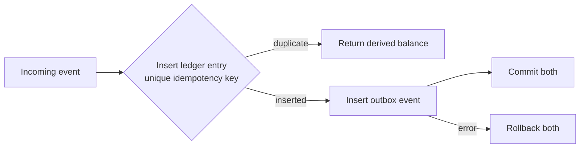

# Reliable Backend Patterns

A small, executable Go example of three rules I use in production backends:

1. record money-like values as signed integers
2. let a unique idempotency key reject duplicate delivery
3. write the domain entry and its outbox event in one transaction

This is intentionally not a framework and not client source. It is the smallest code sample that makes the transaction boundary and duplicate behavior visible.

## The contract

```go
result, err := service.Record(ledger.Event{
    IdempotencyKey: "order-paid:1001",
    AccountID:     "customer-42",
    Amount:        1250,
    Reference:     "order-1001",
})
```

- `Amount` is `int64`; refunds and reversals are negative entries.
- the first idempotency key records one ledger entry and one outbox event
- the same key again returns `Recorded: false` without adding either row
- balance is derived from entries rather than stored as a mutable customer field
- an error anywhere in the transaction leaves both collections unchanged

## Transaction shape



`ledger.MemoryStore` is an executable reference implementation used by the tests. It copies transaction state and publishes it only when the callback succeeds. [`migrations/001_init.sql`](migrations/001_init.sql) shows the PostgreSQL constraints the same contract relies on in production: a unique idempotency key, `BIGINT` amounts, and an outbox table committed beside the ledger.

## Run

```bash
go test -race ./...
go vet ./...
```

The tests cover first delivery, duplicate delivery, signed integer balances, and rollback when the outbox step fails.

## Why balance is not a column

A mutable `balance` column cannot explain itself. With append-only entries, a support or finance question can be answered by listing the rows that produced the number. Refunds do not erase history; they add an entry with the opposite sign.

For high-volume ledgers, a projection or cached balance can be added. The ledger remains the source of truth and the projection must be rebuildable from it.

## What a PostgreSQL adapter would do

The adapter is deliberately left out so the example stays focused. Its `Transact` implementation would:

1. begin a database transaction
2. insert the ledger row with `ON CONFLICT (idempotency_key) DO NOTHING`
3. insert the outbox row only when the ledger row was inserted
4. calculate or read the account projection
5. commit once

The important boundary is the interface and schema constraint, not a particular SQL library.

---

## 한국어 요약

운영 백엔드에서 반복해서 쓰는 세 가지 규칙을 작은 Go 예제로 만들었습니다.

- 금액과 포인트는 부호 있는 정수로 저장합니다.
- 중복 이벤트는 코드의 사전 조회가 아니라 DB unique 제약으로 막습니다.
- 원장 항목과 outbox 이벤트는 같은 트랜잭션에서 기록합니다.

고객사 코드를 옮긴 저장소가 아니며, 멱등성·정수 원장·트랜잭션 경계를 실행 가능한 최소 코드로 보여주는 샘플입니다.

